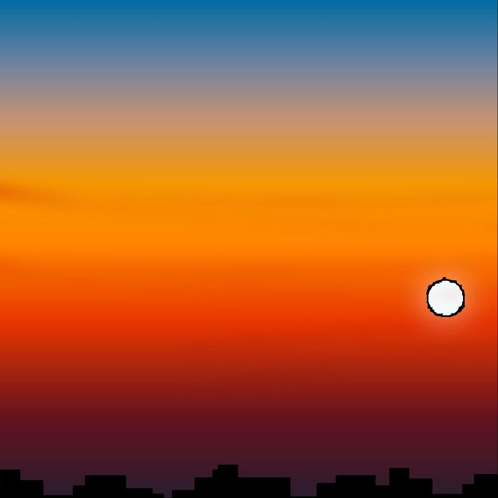
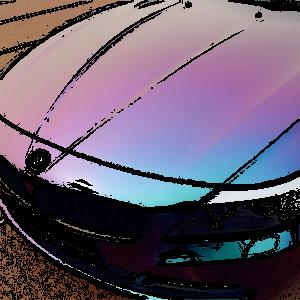
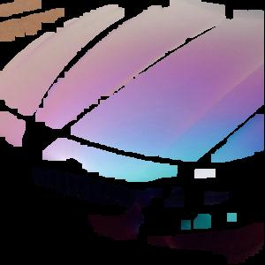
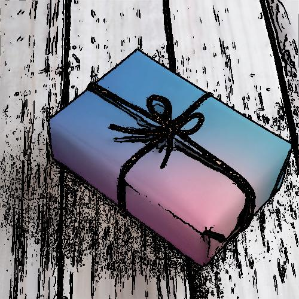
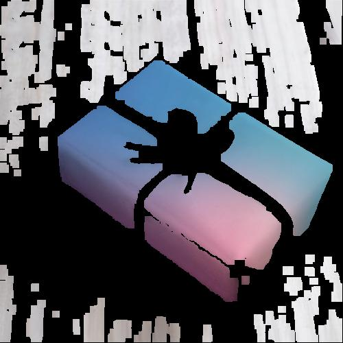

# Решение задачи №212 практического задания для отбора на кафедру КИС

## Как запустить
* `./setup.sh` - установка необходимых пакетов python
* `./run.sh image out_dir`, где `image` - это путь до картинки, а `out_dir` - путь, где создать изображение

## Описание алгоритма
За основу взят оператор Собеля — дискретный дифференциальный оператор, вычисляющий приближённое значение градиента яркости изображения (он используется для рисования границ на изображениях).
С помощью опертора Собеля вычисляются изменения яркости в каждой точке. 
Если численное значение большое, то в этой точке находится граница.
Градиентам же присуще небольшое изменение цвета. На этом факте и основан алгоритм.

По предположению, если в точке значение оператора Собеля больше какой-то константы, то она не может принадлежать градиенту.
Удалив все такие точки (закрасив черным), получаем файл `inter.jpg`.
После удаления лишних точек, ищутся квадраты с фиксированной стороной (в пикселях), где нет лишних точек.
Так получается файл `final.jpg`

#### P. S.
В алгоритме не учитываются изображения с кусками одного цвета (наверное, их можно отнести к градиентам, у которых цвета равны). 
Если пытаться убирать области с постоянным цветом, то они могут быть внутри какого-то большого градиента.

## Примеры работы
### Обычный градиент
#### Изначальная картинка:

#### Картинка после удаления точек границы:

#### Финальная картинка:

### Закат

#### Изначальная картинка:

#### Картинка после удаления точек границы:

#### Финальная картинка:

### Машина с градиентной раскраской

#### Изначальная картинка:

#### Картинка после удаления точек границы:

#### Финальная картинка:

### Книга

#### Изначальная картинка:

#### Картинка после удаления точек границы:

#### Финальная картинка:

